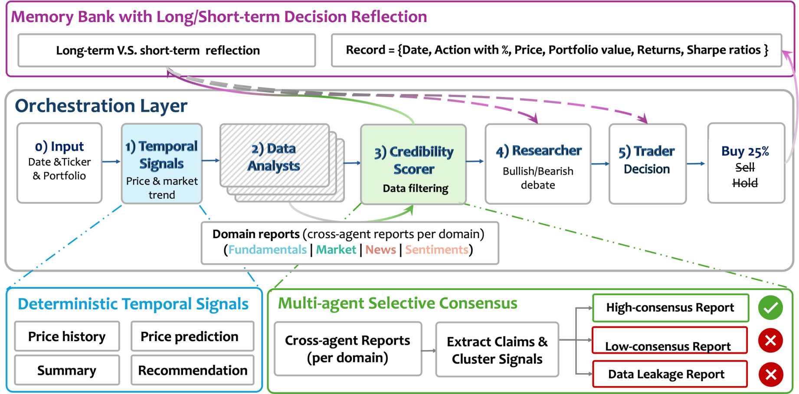
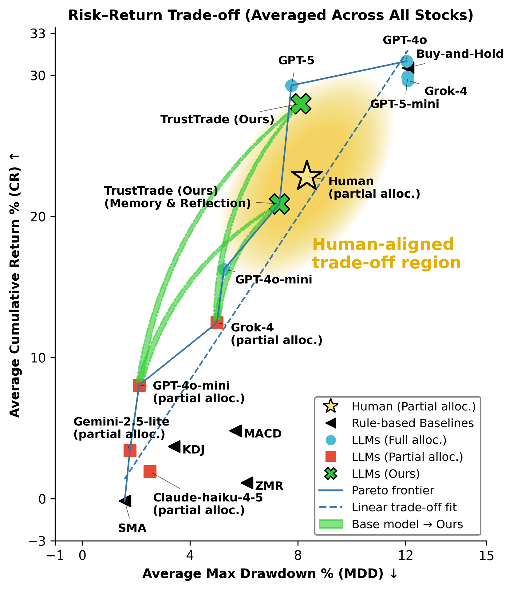

<div align="center">

# 📈 TrustTrade

### Human-Inspired Selective Consensus Reduces Decision Uncertainty in LLM Trading Agents

The official implementation release for our 2026 paper.

[**Paper**](https://arxiv.org/abs/2603.22567) |
[**HTML**](https://arxiv.org/html/2603.22567) |
[**PDF**](https://arxiv.org/pdf/2603.22567) |
[**DOI**](https://doi.org/10.48550/arXiv.2603.22567) |
[**Code**](https://github.com/Harvard-AI-and-Robotics-Lab/TradingAgent)

<br>

[](https://arxiv.org/abs/2603.22567)
[](pyproject.toml)
[](LICENSE)
[](docs/REPRODUCIBILITY.md)

[Overview](#-overview) · [Framework](#-framework) · [Results](#-main-results) ·
[Agent Code](#-agent-implementation) · [Quick Start](#-quick-start) ·
[Reproducibility](#-reproducibility-status)

</div>

## 📝 Citation

If you use this implementation in your research, please cite TrustTrade and the
upstream TradingAgents framework on which it is built:

```bibtex
@misc{li2026trusttrade,
  title         = {TrustTrade: Human-Inspired Selective Consensus Reduces Decision Uncertainty in LLM Trading Agents},
  author        = {Minghan Li and Rachel Gonsalves and Weiyue Li and Sunghoon Yoon and Mengyu Wang},
  year          = {2026},
  eprint        = {2603.22567},
  archivePrefix = {arXiv},
  primaryClass  = {cs.CE},
  doi           = {10.48550/arXiv.2603.22567}
}
```

Machine-readable metadata are available in [`CITATION.cff`](CITATION.cff).
See [`NOTICE`](NOTICE) and [`docs/UPSTREAM.md`](docs/UPSTREAM.md) for upstream
attribution.

## 🔎 Overview

LLM trading agents often exhibit **uniform trust**: retrieved facts and
heterogeneous information sources are treated as equally reliable. In noisy
financial environments, this can amplify hallucinations and produce unstable
portfolio decisions.

TrustTrade replaces uniform trust with three human-inspired mechanisms:

- **Selective consensus:** multiple independent agents analyze each information
  domain; a credibility scorer retains corroborated semantic and numerical
  claims and discounts conflicting evidence.
- **Deterministic temporal grounding:** reproducible price-derived indicators
  anchor trend, momentum, volatility, drawdown and risk exposure.
- **Reflective memory:** short- and long-horizon return/risk feedback adapts
  information weighting and risk preferences at test time, without training.

The paper evaluates **AAPL, GOOG and NVDA**, across **2024 Q1 historical
backtesting** and a **2026 Q1 forward-time study**, with **19 human annotators**
as a behavioral reference.

## 🧭 Framework

<div align="center">
  
</div>

Each decision moves through a controlled evidence pipeline:

```text
Ticker + date + portfolio
          │
          ▼
Deterministic temporal signals
          │
          ▼
Parallel domain analysts ──► credibility scoring ──► high-consensus evidence
                                                        │
                                                        ▼
                                              bull/bear researchers
                                                        │
                                                        ▼
                                              BUY / HOLD / SELL + %
                                                        │
                                                        ▼
                                        short/long reflective memory
```

## 🔑 Main findings

- **Naive multi-source aggregation is not additive.** In the 2024-Q1 study,
  market-only signals at the Analyst stage reach **33.1% cumulative return at
  9.1% maximum drawdown**, while indiscriminately adding sources can inject
  noise rather than improve decisions.
- **Large LLM traders occupy an aggressive regime.** Full-allocation agents
  achieve roughly **30% average cumulative return**, but incur approximately
  **12% maximum drawdown**.
- **Selective consensus stabilizes intermediate decisions.** The
  high-consensus configuration raises average cumulative return from roughly
  **10% to 26%**, while moving maximum drawdown from about **3% to 8%**.
- **Temporal signals add reproducible grounding.** They improve average return
  by about **1 percentage point** while slightly reducing drawdown.
- **Memory and reflection regularize risk.** They trade a small amount of return
  for lower drawdown, moving the operating point toward the human-aligned
  mid-risk/mid-return region.

## 📊 Main results

| Evaluation | Universe | Window | Purpose |
|:--|:--|:--|:--|
| Historical controlled study | AAPL, GOOG, NVDA | 2024 Q1 | diagnose source, reasoning-depth and allocation effects |
| Human comparison | 19 annotators | 2024 Q1 scenarios | characterize selective information use and risk preference |
| Forward-time backtest | AAPL, GOOG, NVDA | 2026-01-01 to 2026-02-18 | reduce future-information leakage |

### Risk–return trade-off

<div align="center">
  
</div>

TrustTrade shifts partial-allocation base models toward a stronger return–risk
frontier. Adding memory and reflection produces the more conservative variant.
The shaded region is the human-aligned reference defined in the paper.

> [!NOTE]
> These values summarize the paper experiments; they are not a promise of live
> trading performance. Backtested performance does not guarantee future results.

## 🧠 Agent implementation

The complete `lmh` research-branch agent package is present: **44 of 44 Python
source files** under `tradingagents/` are included. Public-release changes are
limited to credential safety, portable configuration, dependency-compatible
imports and defensive bug fixes.

| Stage | Core implementation | Responsibility |
|:--|:--|:--|
| Temporal analyst | [`price_analyst.py`](tradingagents/agents/analysts/price_analyst.py) | deterministic price history, trends and forecasts |
| Domain analysts | [`agents/analysts/`](tradingagents/agents/analysts/) | fundamentals, market, news and social reports |
| Credibility layer | [`agents/credibility_scorer/`](tradingagents/agents/credibility_scorer/) | cross-agent consistency, confidence filtering and leakage audit |
| Research debate | [`agents/researchers/`](tradingagents/agents/researchers/) | bull/bear evidence synthesis |
| Trader | [`trader.py`](tradingagents/agents/trader/trader.py) | final action and position sizing |
| Reflective memory | [`memory_bank.py`](tradingagents/graph/memory_bank.py) and [`reflection.py`](tradingagents/graph/reflection.py) | short/long-horizon outcome feedback |
| Orchestration | [`trading_graph.py`](tradingagents/graph/trading_graph.py) and [`setup_multiagent.py`](tradingagents/graph/setup_multiagent.py) | graph construction and multi-agent execution |
| Optional risk debate | [`agents/risk_mgmt/`](tradingagents/agents/risk_mgmt/) | upstream-compatible aggressive/neutral/conservative debate |

The paper's main experiments omit the final Risk Manager stage after finding no
systematic improvement, but its implementation remains available for ablations
and upstream compatibility.

## 📦 Released artifacts

```text
tradingagents/
  agents/                       complete analyst, scorer, researcher and trader stack
  graph/                        orchestration, consensus, memory and reflection
  dataflows/                    online/offline data interfaces

baseline_analysis/              rule-based and LLM backtesting code
configs/
  models.template.json          provider/model registry without credentials
  experiments/                  safe example experiment manifests
tools/                          plotting code and consensus diagrams
assets/                         README framework and result figures
docs/
  DATA.md                       data, privacy and redistribution policy
  RELEASE_CHECKLIST.md          security-to-publication author checklist
  REPRODUCIBILITY.md            reproduction workflow and known boundaries
  UPSTREAM.md                   TradingAgents provenance and modifications
scripts/
  check_release.py              offline secret/privacy/structure checks
  run_experiment.py             manifest-driven experiment launcher
  validate_release.sh           one-command validation; no API calls
tests/                          offline release and configuration tests
```

This public tree intentionally excludes credentials, notebook state,
person-level human-study records, generated run directories and
provider-restricted data caches.

## 🚀 Quick start

```bash
git clone https://github.com/Harvard-AI-and-Robotics-Lab/TradingAgent.git
cd TradingAgent

python -m venv .venv
source .venv/bin/activate
python -m pip install --upgrade pip
pip install -e .

bash scripts/validate_release.sh
```

For rule-based baselines and plotting utilities, install the analysis extras:

```bash
pip install -e ".[analysis]"
```

The validation command checks Python syntax, required release files, JSON
manifests, accidental credentials, private machine paths and person-level data
fields. It makes **no network requests or model API calls**.

## 🔐 Configure providers

Copy `.env.example` only as a reference and export credentials through your
shell or secret manager. Never commit `.env` files or notebook credentials.

```bash
export OPENAI_API_KEY=...
export FINNHUB_API_KEY=...

# Optional providers
export ANTHROPIC_API_KEY=...
export GOOGLE_API_KEY=...
export XAI_API_KEY=...
```

Provider availability and model identifiers change over time. Review
[`configs/models.template.json`](configs/models.template.json) before running an
experiment.

## ▶️ Run TrustTrade

### One decision

The default `trusttrade` mode uses two independent analyst calls and a
credibility scorer. This is a small functional example, not the full paper
sweep.

```bash
python main.py \
  --ticker NVDA \
  --trade-date 2024-05-10 \
  --mode trusttrade \
  --provider openai \
  --model gpt-4o-mini
```

Use `--mode base` for the upstream single-analyst path. Run
`python main.py --help` for multi-provider analyst and scorer options.

### Experiment manifest

Preview an experiment command without making API calls:

```bash
python scripts/run_experiment.py \
  --config configs/experiments/2024_q1.example.json \
  --symbol AAPL \
  --dry-run
```

Remove `--dry-run` to execute.

> [!IMPORTANT]
> TrustTrade can make multiple paid model and data-provider calls per trading
> decision. Review provider pricing and rate limits before running a sweep.

## 🧪 Reproducibility status

| Level | Status | What it means |
|:--|:--:|:--|
| Offline software validation | ✅ | syntax, manifests, release hygiene and tests pass without APIs |
| Clean-environment installation | ✅ | package, core imports and both CLI entry points are verified |
| Functional provider run | 🔑 | requires valid model/data credentials and incurs external cost |
| Exact paper-result reproduction | 🚧 | requires author-approved frozen manifests, caches and model snapshots |

The supplied `*.example.json` manifests are safe launch templates; they are not
represented as the exact paper manifests. See
[`docs/REPRODUCIBILITY.md`](docs/REPRODUCIBILITY.md) for the scientific
reproduction contract and [`docs/RELEASE_CHECKLIST.md`](docs/RELEASE_CHECKLIST.md)
before making the repository public.

## 🧑‍🔬 Human-study and market data

This repository does not distribute identifiable participant records. Human
study artifacts should be released only after a separate consent, ethics and
de-identification review. Market, news, social-media and model-generated data
may carry provider-specific redistribution restrictions. See
[`docs/DATA.md`](docs/DATA.md).

## 🏗️ Upstream framework

TrustTrade is derived from
[`TauricResearch/TradingAgents`](https://github.com/TauricResearch/TradingAgents),
released under Apache-2.0. TrustTrade adds multi-agent credibility scoring,
selective-consensus routing, deterministic temporal signals, portfolio-aware
backtesting and reflective memory. Please retain upstream attribution when
redistributing this work.

## ⚠️ Research-use disclaimer

This software is for research and educational purposes only. It is not
financial, investment, legal or trading advice. Users are responsible for
provider costs, data rights, model outputs and any decisions made with this
software.

## 🏷️ License

The code is released under the [Apache License 2.0](LICENSE). Third-party data,
model outputs and service APIs are governed by their respective terms.
